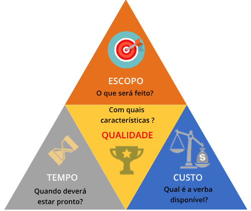

# 1.2. Gerenciamento de Projetos

# Por que gerenciar projetos?

Segundo o guia PMBOK:

> “*O gerenciamento de projetos é a aplicação do conhecimento, das habilidades, das ferramentas e das técnicas às atividades do projeto para atender seus requisitos*”.
>

Em outras palavras, o gerenciamento de projetos **disponibiliza às organizações uma diversidade de processos gerenciais** organizadamente descritos. Na prática, esses processos constituem **boas práticas** que, se forem seguidas, contribuirão para que a **realização de qualquer projeto seja eficiente**.

## Vantagens do uso de técnicas de gerenciamento de projetos

1. **Iniciação**: reconhecer que um projeto ou uma fase deve começar e comprometer-se com sua execução.
2. **Planejamento**: planejar e manter um esquema de trabalho viável para atingir aqueles objetivos de negócio que determinaram a existência do projeto.
3. **Execução**: coordenar pessoas e outros recursos para realizar o que foi planejado.
4. **Controle**: assegurar que os objetivos do projeto estão sendo atingidos, por meio da monitoração e da avaliação de seu progresso, realizando ações corretivas quando necessário.
5. **Finalização**: formalizar a aceitação do projeto ou da fase, e fazer seu encerramento de forma organizada.

# Métodos de Gerenciamento

## Planejar riscos

Planejar riscos significa **reunir em um conjunto os eventos que podem ocorrer sob a forma de ameaças ou de oportunidades** que, se concretizadas, podem influenciar o objetivo do projeto negativa ou positivamente.

O risco do insucesso está no centro das preocupações do gerenciamento de projetos. Identificar as possíveis causas desses riscos e tratá-las é o grande desafio de quem gerencia e trabalha com projetos.

## Planejar prazos

O gerenciamento do prazo ou tempo do projeto tem como objetivo administrar os prazos e as atividades necessárias para a **execução dos entregáveis**, determinados em seu escopo (documento onde é descrito tudo que deverá ser feito no projeto).

Além disso, inclui procedimentos para definir, estimar e sequenciar as atividades ou tarefas, e recursos (pessoas, materiais e equipamentos) para realizar as atividades dentro de uma programação determinada.

Os principais processos de prazo e tempo são:

- Definições das atividades: identificação das atividades específicas do cronograma que serão executadas para produzir os diversos entregáveis.
- Sequenciamento das atividades: identificação e documentação das dependências entre as atividades do cronograma.
- Estimativa de recursos: estimativa das quantidades a serem usadas durante a execução das atividades do cronograma.
- Estimativa de duração das atividades: estimativado período necessário para a conclusão de cada atividade do cronograma.
- Desenvolvimento e controle do cronograma: análise e definição das sequências de atividades, dependências e durações, e de quais recursos serão utilizadas para criar o cronograma, bem como o controle das atividades entregues e suas alterações.

## Planejar custos

Ao aplicar esse método, o gerente de projetos deve buscar garantir um nível de consistência na forma como a informação das estimativas de custo é apresentada.

É importante que essa apresentação também garanta a consistência da forma como foram levantadas as suposições que oferecem suporte à informação do custo.

Dessa forma, é preciso apresentar uma documentação eficaz para embasar essa informação. Sem isso, as bases para as estimativas podem ser mal interpretadas ou consideradas de forma indevida.

## Planejar qualidade

O gerenciamento da qualidade deve ser direcionado tanto aos processos de gerenciamento do projeto quanto ao produto ou serviço final por ele proposto.

Segundo o PMI, “um projeto com qualidade é aquele concluído em conformidade com os requisitos, as especificações e a adequação do uso”.

# Escopo e Restrição Tripla

## Escopo

> [!NOTE]
 Chamamos de escopo a descrição do trabalho que precisa ser realizado para entregar um produto, serviço ou resultado, com as características e as funções especificadas. Na prática, denomina-se escopo um documento que registra o detalhamento do alvo do projeto, com a maior riqueza de detalhes possível.

## Restrição tripla

Segundo o PMBOK, durante o projeto, é necessário gerenciar e controlar situações, solicitações e necessidades que apresentem conflito ou possam comprometer o escopo, o tempo e os custos.

A gerência de projetos deve ser entendida como **a condução dos custos necessários para a execução de um projeto, dentro de um escopo delimitado e das condições de prazo e de custos definidas para ele**.

Essa restrição de prazo, de custos e de escopo, a que todos os projetos estão sujeitos, é conhecida pela expressão “**restrição tripla”.**

A qualidade está relacionada a esses três pontos, uma vez que as demandas conflitantes podem ser influenciadas pelo risco positiva ou negativamente. Isso impacta a percepção da qualidade diretamente.

### Como a restrição tripla funciona na prática?

1. Se o equilíbrio for mantido, o projeto é entregue com qualidade. 
2. Por outro lado, se, por exemplo, o prazo for reduzido sem aumento do custo ou sem redução de escopo, a qualidade será afetada e, provavelmente, decairá. Com isso, o balanceamento do projeto será prejudicado.

> [!NOTE]
 De um modo geral, o que deve-se ter em mente é que a **alteração de qualquer um dos pilares que sustentam a restrição tripla afeta os demais pilares**.

Agora, diferentes métodos podem ser aplicados para restringir cada um dos aspectos observados:

1. **Restrição de Escopo**: a restrição mais difícil de se controlar é a de escopo, junto a suas especificações. Geralmente, as dificuldades envolvem desenvolver uma apresentação clara e criar uma forma de monitoramento.
2. **Restrição de tempo**: para ajudar na restrição de tempo, é preciso desenvolver um **cronograma e definir prazos por meio de ferramentas** como PERT/CPM, GERT e Gráfico de Gantt.
3. **Restrição de custo**: no processo de restrição de custo, que envolve orçamentos, o controle é feito com o **uso de gráficos**, como o **histograma de recursos**.

> [!NOTE] 
 Um histograma de recursos ilustra a distribuição do esforço de um recurso no tempo. Em gestão de projetos, é uma ferramenta que contribui para análise de eficiência na distribuição dos recursos, pois, por meio da visualização do histograma, podem-se nivelar os recursos utilizados no projeto.

# Nove áreas de conhecimento

> [!IMPORTANT]
 Segundo o PMBOK, uma “*área de conhecimento é definida por seus requisitos de conhecimento e descrita em termos dos processos que a compõem, suas práticas, entradas, saídas, ferramentas e técnicas*”. O guia PMBOK orienta que, para serem eficientemente gerenciados, os projetos devem levar em conta as nove áreas do conhecimento.

## Escopo

Descreve os processos envolvidos na verificação de que o projeto:

1. Inclua todo o trabalho necessário para que seja concluído com sucesso.
2. Execute somente aquilo que estiver dentro do escopo, sem nenhum desvio.

## Custos

Descreve os processos envolvidos em planejamento, estimativa, orçamentação, e controle de custos, considerando que o projeto deve terminar dentro do orçamento planejado. Dentro de custos estão os processos de estimativa de custos, orçamento e controle de custos.

## Tempo

Estima e define a duração das atividades que serão controladas durante a execução do projeto, permitindo a definição de um cronograma ou de uma linha do tempo.

## Qualidade

Descreve os processos envolvidos na garantia que o projeto irá satisfazer os objetivos para os quais foi realizado. Tais objetivos devem ser cumpridos dentro de padrões e normas. Por isso, deve ser realizada uma auditoria de controle de qualidade, garantindo que o produto ou serviço esteja dentro das especificações predefinidas.

## Riscos

Abrange a especificação a análise e a resposta a riscos do projeto, o planejamento e o monitoramento e controle. Em outras palavras, trata-se de aumentar a probabilidade de as entregas serem positivas, e diminuir a probabilidade de adversidades e resultados negativos.

## Recursos Humanos

Área que organiza e gerencia pessoas ou equipe do projeto. Nela são determinados o perfil dos profissionais, a hierarquia e quem é responsável por cada área de execução. Esta área mobiliza e desmobiliza os recursos do projeto, cuida do treinamento e da capacitação, e ajuda a resolver conflitos.

## Comunicação

Em um projeto, todos os elementos devem saber o que se espera deles, o que, e como deve ser feito, o que se passa no projeto, quem deve ser informado sobre o que e quando. Para tanto, todo o capital intelectual somado por meio das lições que aprendemos requer uma comunicação forte e saudável, sem ruídos ou mensagens dissonantes.

## Aquisições

Aborda os processos necessários para a aquisição de mercadorias e serviços fora da organização que desenvolve o projeto. Visa determinar:

- O que se deseja adquirir
- De quem se quer adquirir
- Receber as respostas dos fornecedores e selecionar um deles
- Definir como se dará o gerenciamento dos contratos e dos pagamentos
- Definir se as entregas estão de acordo com o que foi estabelecido
- Pagar o fornecedor
- Formalizar a finalização do contrato.

## Integração

Visa integrar, harmonizar e coordenar os processos das demais gestões para obter o máximo de desempenho e resultado no processo de gerenciamento do projeto.