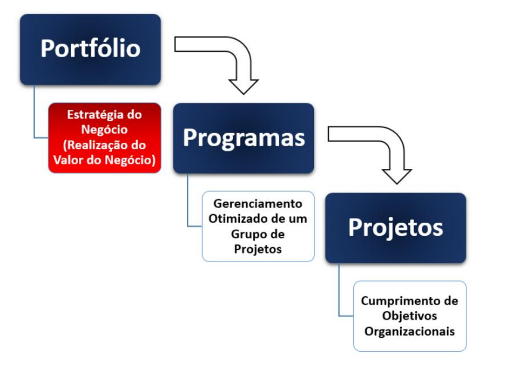

# Aula 02

# Importância do gerenciamento de projetos

- **Gerenciamento de projetos é a aplicação de conheciemtos, habilidades, ferramentas e técnicas às atividades do projeto a fim de cumprir os seus requisitos**.
- O gerenciamento de projetos é realizado através da aplicação e integração apropriadas de processos de gerenciamento de projetos identificado para o projeto.
- O gerenciamento de projetos permite que as organizações executem projetos de forma eficaz e eficiente.

## O gerenciamento de projetos eficaz ajuda indivíduos, grupos e organizações públicas e privadas a:

- Cumprirem os objetivos do negócio;
- Satisfazerem as expectativas das partes interessadas;
- Serem mais previsíveis;
- Aumentarem suas chances de sucesso;
- Entregarem os produtos certos no momento certo;
- Resolverem problemas e questões;
- Responderem a riscos em tempo hábil;
- Otimizarem o uso dos recursos organizacionais;
- Identificarem, recuperarem ou eliminarem projetos com problemas;
- Gerenciarem restrições (por exemplo, escopo, qualidade, cronograma, custos, recursos);
- Equilibrarem a influencia de restrições do projeto (por exemplo, o
aumento de escopo pode aumentar custos ou o prazo); e
- Gerenciarem melhor as mudanças

## Os projetos mal gerenciados ou a ausência do gerenciamento de projetos podem resultar em:

- Prazos perdidos
- Estouros de orçamento
- Má qualidade
- Retrabalho
- Expansão descontrolada do projeto
- Perda da reputação para a organização
- Partes interessadas insatisfeitas
- Incapacidade de alcançar os objetivos para os quais o projeto foi empreendido

## O gerenciamento de projetos eficaz e eficiente deve ser considerado uma competência estratégica nas organizações

- Isso permite que as organizações
    - Vinculem os resultados do projeto com os objetivos do negócio,
    - Concorram com mais eficácia nos seus mercados
    - Sustentem a organização
    - Respondam ao impacto das mudanças de ambiente de
    negócios nos projetos, ajustando adequadamente os planos de
    gerenciamento de projetos
    
    
    

# Gerenciamento de Portfólios

- Um portfólio é definido como projetos, programas, portfólios subsidiários e operações, gerenciados em grupo para alcançar objetivos estratégicos.
- O gerenciamento de portfolios e definido como o gerenciamento
centralizado de um ou mais portfolios para alcançar objetivos estratégicos. Os programas ou projetos do portfolio podem não ser necessariamente interdependentes ou diretamente relacionados.

# Gerenciamento de Programas

- O gerenciamento de programas é definido como a aplicação de conhecimentos, habilidades e princípios a um programa para atingir os objetivos do programa e obter benefícios e controle que de outra forma não estariam disponíveis através do gerenciamento individual dos componentes do programa.
- Um componente do programa refere-se a projetos e outros programas de um mesmo programa.
- O gerenciamento de projetos foca nas interdependências dentro de um projeto para determinar a abordagem ideal para gerenciar o
projeto.
- O gerenciamento de programas foca nas interdependências entre projetos e entre projetos e o nível do programa para determinar
a abordagem ideal para gerencia-los.

# Ciclos de vida do projeto

- O **ciclo de vida do projeto** é a série de fases pelas quais um projeto passa, do início à conclusão.
- Ele **fornece a estrutura básica para o gerenciamento do projeto**.
- Esta estrutura básica se aplica independentemente do trabalho do projeto específico envolvido.
- As fases podem ser **sequenciais, iterativas ou sobrepostas**.
- Todos os projetos podem ser mapeados na estrutura genérica do ciclo de vida.
- Os níveis de **custo** e de **mobilização** (e desmobilização) de **recursos**, normalmente, são **baixos no início, aumentam à medida que o trabalho é executado** e diminuem velozmente conforme **o projeto é finalizado**.
- Normalmente, **o risco é maior no início do projeto**. Esses fatores diminuem ao longo do ciclo de vida do projeto, à medida que as decisões são tomadas e as entregas são aceitas.
- O **custo das mudanças** e de correções de erros geralmente **aumentam** significativamente à medida que o projeto se **aproxima do fim**.

# Ciclos de vida do projeto e do desenvolvimento

Em um ciclo de vida do projeto, há **geralmente uma ou mais fases associadas com o desenvolvimento do produto, serviço ou resultado**.

Em um **ciclo de vida preditivo, o escopo, prazo e custo do projeto são determinados nas fases iniciais do ciclo de vida**. Quaisquer alterações ao escopo são cuidadosamente gerenciadas. Os ciclos de vida preditivos são também chamado de `ciclos de vida em cascata`.

# Fase do projeto

- A fase de um projeto é um **conjunto de atividades relacionadas de maneira lógica** que culmina na **conclusão de uma ou mais entregas**.
- As fases de um ciclo de vida podem ser descritas por diversos atributos, podendo ser mensuráveis ou exclusivos de uma fase específica.
- O uso de **várias fases pode fornecer uma visão melhor para gerenciar um projeto**.
- Fornece uma **oportunidade para avaliar o desempenho do projeto e tomar medidas corretivas** ou preventivas necessárias em fases subsequentes.